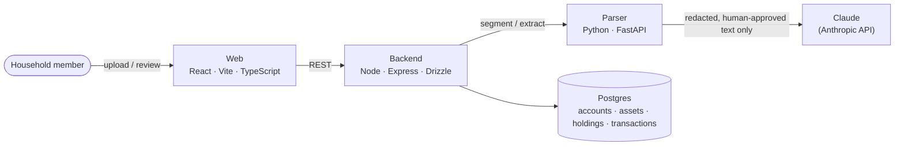

# Vantage

[](https://github.com/HilelLustiger/vantage/actions/workflows/checks.yml)
[](https://github.com/HilelLustiger/vantage/actions/workflows/integration.yml)
[](backend/package.json)
[](parser/requirements.txt)

A private, self-hosted financial tracking platform for a single household — not a SaaS product, runs locally.

Vantage's one job: turn a household's own PDF statements (brokerage, pension, savings) into a single, aggregated view of what they hold and how it's moved, without ever sending an unredacted document to a third party. A human always approves what's sent to the model, and every extracted figure is shown back in plain language for confirmation before it's committed.

## Architecture



`parser` is a stateless, database-credential-free service by design (see [ADR-0001](docs/ADR/0001-system-architecture-and-service-topology.md)) — it never holds both a raw document and a DB connection at once, so a compromised or misbehaving parser process can't reach the data store. It never talks to Claude directly either, in the sense that mattered for that ADR: everything crossing that boundary has already been through the redaction and human-approval steps below.

## Highlights

- **A human approves what reaches the model, every time** — a document is segmented into lines, a per-line sensitivity check flags anything that looks like an ID number or a captured identity value (account holder, account number), and a reviewer clicks directly on the rendered PDF to mark each region green (send) or leave it unmarked (never sent). Nothing goes to Claude without that explicit approval.
- **Institution-agnostic parsing, not per-bank code** — the old approach (a hand-written extractor per institution/layout) was deleted outright in favor of one linear pipeline: segmentation → sensitivity check → LLM-assisted extraction → deterministic formatting. Adding a new institution costs nothing in code.
- **Every extracted figure is a claim, not a fact** — the review screen states in plain language what the model read off the document ("the model found that the current value of X as of [date] is [value] [currency]"), with each figure individually editable and confirmable before anything is written to the database.
- **Deterministic asset matching only** — Assets are matched to existing holdings by ticker/ISIN/security number, never by AI or fuzzy string matching (see [ADR-0004](docs/ADR/0004-domain-model-core.md)); ambiguous matches always fall to a human.
- **Holdings and transactions tracked independently** — a statement can report a current value and dated activity (deposits, withdrawals, buys, sells) as two separate, never-inferred-from-each-other facts; nothing is derived from a change between two snapshots.
- **Decisions on record** — architecturally significant choices (service topology, ingestion pipeline design, multi-currency valuation, the AI-extraction privacy model) are captured as [ADRs](docs/ADR/) before being built.

## Structure

```
vantage/
├── backend/    # Node/Express/Drizzle — auth, accounts/assets/holdings, the Document state machine
├── web/        # React/Vite/TypeScript — the UI, including the PDF-overlay review screens
├── parser/     # Python/FastAPI — segmentation, sensitivity checks, LLM-assisted extraction, formatting
├── test/       # cross-service integration tests, run against a real Postgres
└── docs/ADR/   # architecturally significant decisions, recorded before being built
```

Each service owns its own dependencies and tests; `docker-compose.yml` orchestrates all of them plus Postgres for local development.

## Tech stack

| Layer    | Choices                                                                                                |
| -------- | ------------------------------------------------------------------------------------------------------ |
| Backend  | Node, Express, Drizzle ORM, Zod, `express-session`                                                     |
| Frontend | React, Vite, TypeScript, Tailwind CSS, `pdfjs-dist` (in-browser PDF rendering), Recharts               |
| Parser   | Python 3.12, FastAPI, `pdfplumber` (PDF segmentation with coordinate extraction), `anthropic` (Claude) |
| Data     | PostgreSQL                                                                                             |
| Ops      | Docker Compose, GitHub Actions CI (fast DB-free checks + full Postgres-backed integration)             |
| Testing  | Vitest (web/backend/integration), pytest (parser)                                                      |

## Local development

Requires Docker (for Postgres, backend, web, and parser) and Node 20+ on the host for the one-time setup below.

```sh
cp .env.example .env   # then edit SESSION_SECRET/POSTGRES_PASSWORD, add ANTHROPIC_API_KEY
docker compose up
```

This starts Postgres, the backend (`:3001`), the frontend (`:5173`), and the parser (internal-only, no host port). First run, in another terminal:

```sh
npm install
npm run db:migrate --workspace=backend
npm run create-user --workspace=backend -- --email you@example.com --password <password>
```

There's no signup flow — creating a user is always done this way (see [ADR-0003](docs/ADR/0003-auth-and-secrets.md) for the reasoning behind manual account management).

### Run tests

```sh
npm run lint --workspaces
npm run typecheck --workspaces
npm test --workspaces
```

Backend/integration tests need a real Postgres — `.husky/pre-push` runs the full suite automatically before every push; `.husky/pre-commit` runs the fast, DB-free subset on every commit.

## CI

`.github/workflows/checks.yml` runs the fast, DB-free tier (lint, typecheck, web unit tests, `ruff`/pytest for the parser) on every push and PR. `.github/workflows/integration.yml` runs the full suite against a real Postgres service container. Both mirror their respective git hooks exactly, so a green local push means a green CI run.

## License

All rights reserved.
